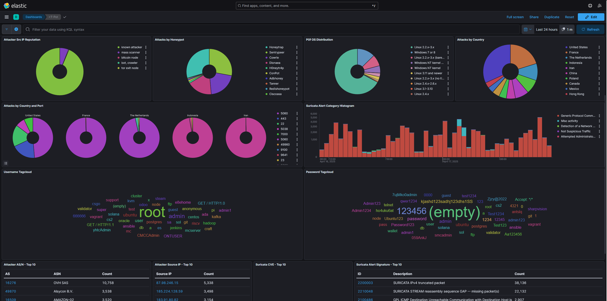
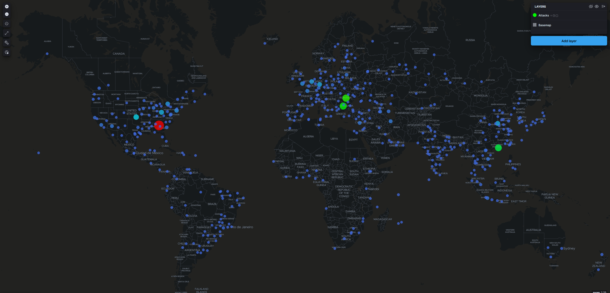
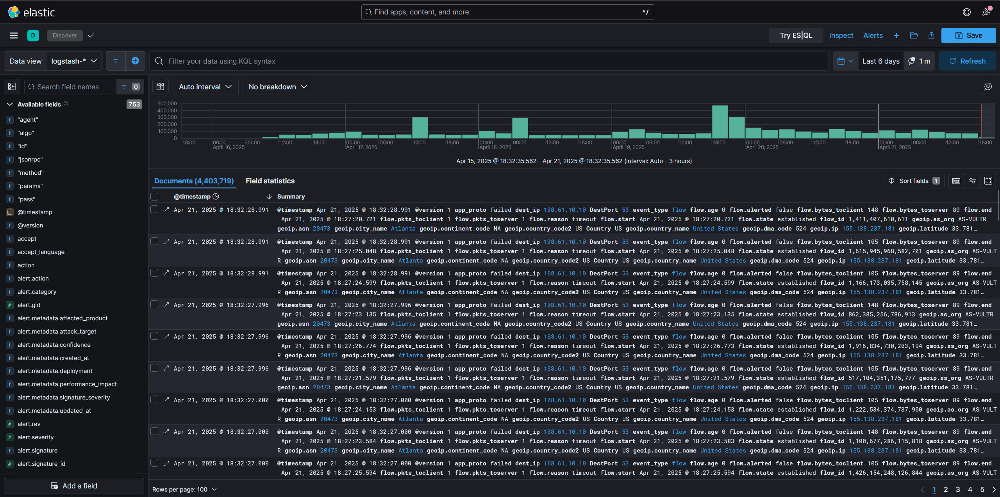

# 🛡️ T-Pot Honeypot Cloud Deployment Project

This project documents the deployment of the [T-Pot Honeypot](https://github.com/telekom-security/tpotce) platform on a cloud-hosted Ubuntu 24.04 LTS server. T-Pot is a multi-container honeypot system that collects, analyzes, and visualizes real-world cyberattacks using Docker-based sensors and the ELK (Elastic) Stack.

In this project, I deployed T-Pot on a **Vultr Cloud** instance, but the same setup can be reproduced on **AWS EC2**, **Azure VM**, or any other public cloud provider supporting Ubuntu 24.04 LTS.


---

## 🎯 Objective

The goal of this project is to observe common attack patterns on exposed cloud infrastructure. By running T-Pot in a controlled Vultr environment, I collected real-world threat data and analyzed it to gain insights on how attackers behave in the wild, especially relevant to airport and critical infrastructure security.

---

## 🛠️ Setup - Deployment Instructions

### 1️⃣ Provision the Ubuntu Server

1. Go to your preferred cloud provider (e.g., [Vultr](https://www.vultr.com/), AWS EC2, Azure, DigitalOcean)
2. Create a new virtual machine (VM) or instance
3. Choose **Ubuntu 24.04 LTS x64** as the OS
4. Allocate at least:
   - 16 GB RAM
   - 320 GB SSD
5. Add your **SSH public key** for secure access
6. Deploy the server and note the public IP address

---

### 2️⃣ Initial Setup (as Root)

```bash
ssh root@<your_server_ip>
apt update && apt upgrade -y
apt install git -y
```

---

### 3️⃣ Create a Non-Root User for T-Pot

```bash
adduser tsec
usermod -aG sudo tsec
su - tsec
```

---

### 4️⃣ Install T-Pot

```bash
git clone https://github.com/telekom-security/tpotce
cd tpotce
./install.sh --type=user
```

- Select **Standard** installation
- Set a secure password for access

---

### 5️⃣ Reboot the Server

```bash
reboot
```

> ⚠️ First boot may take 5–10 minutes to initialize all containers.

---

### 6️⃣ Configure Vultr Firewall

| Action | Protocol | Ports       | Source     | Description                                 |
|--------|----------|-------------|------------|---------------------------------------------|
| Accept | TCP      | 1–65535     | 0.0.0.0/0  | Allow all TCP traffic for honeypots         |
| Accept | UDP      | 1–65535     | 0.0.0.0/0  | Allow all UDP traffic for honeypots         |
| Accept | TCP      | 64294–64297 | 0.0.0.0/0  | Access to Web UI, Kibana, and Admin         |
| Drop   | Any      | All         | 0.0.0.0/0  | Block all other traffic                     |


---

### 7️⃣ Access the Dashboards

- T-Pot Admin UI → `https://<your-ip>:64294`
- Kibana Dashboard → `https://<your-ip>:64297/kibana`
- Attack Map → `https://<your-ip>:64297/map/`

> 🔐 Accept browser warning for self-signed certificate.

---

## 🔐 Security Hardening

- Created non-root user (`tsec`) for deployment
- Disabled root SSH login and password authentication
- SSH secured with key-based access only
- Vultr Cloud Firewall rules applied to restrict traffic
- UI ports are public but can be locked to IP in production

---

## 📈 Findings (After 5 days of deployment)

Using the Kibana dashboard and raw log discovery:

- **Total Honeypot Hits**: Over **446,000** attack attempts
- **Top Services Targeted**:
  - `Sentrypeer` – 257k
  - `Honeytrap` – 95k
  - `Cowrie` (SSH) – 54k
  - `Dionaea` (malware) – 32k
- **Common Usernames**: `root`, `admin`, `ubuntu`, `oracle`, `postgres`
- **Most Frequent Passwords**: `123456`, `Password123!`, `admin123`, `P@ssw0rd`, `Huawei@123`, `qwer1234`, `(empty)`
- **Suricata Alerts**:
  - IPv4 truncated packets (188k)
  - Stream reassembly gaps (103k)
  - Broken TCP ACKs and invalid packets
- **Top Attacking Countries**:
  - 🇷🇴 Romania
  - 🇺🇸 United States
  - 🇫🇷 France
  - 🇨🇳 China
  - 🇧🇬 Bulgaria
- **Attacker Types**: Known scanners, anonymizers, botnets, Tor exit nodes
- **Most Common Ports Scanned**: 5060, 445, 443, 22, 23

📸 Kibana Dashboard


📸 Attack Map


📸 Suricata Alerts & KQL Discovery:


---

## ✈️ Takeaways

This deployment confirmed that exposing unprotected infrastructure on the internet results in immediate and sustained targeting from global threat actors. Key lessons:

- 🕒 **Immediate Targeting**: Attack attempts began within minutes of exposure, emphasizing the importance of default hardening before public deployment.
- 🔐 **Credential Abuse is Rampant**: The volume of SSH brute-force attempts and reused default passwords (like `123456`, `root`, and `admin`) indicates widespread scanning automation.
- 🌐 **Diverse Threat Actors**: Attacks originated from a wide range of IPs across multiple continents, with notable ASNs like OVH, Amazon, and cloud VPN exit nodes.
- 🧪 **Honeypots Are Effective Simulators**: T-Pot provided valuable, low-risk visibility into attacker tactics, tools, and patterns—critical for blue teams and SOC analysts.
- ✈️ **Relevance to Critical Infrastructure**: For sectors like aviation, energy, and healthcare, exposing even a misconfigured service can act as a beacon for attackers. This reinforces the need for layered defense, traffic monitoring, and least privilege configurations.

---

## 📘 What’s Next

- 📦 **Automate Log Archival**: Set up cron jobs or Logstash pipelines to back up logs daily to an S3 bucket or cloud storage.
- 🚨 **Enable Real-Time Alerting**: Integrate Slack, Microsoft Teams, or email alerts using Suricata or Filebeat.
- 🧠 **Enrich Threat Data**: Correlate IPs against public blocklists (AbuseIPDB, AlienVault OTX, etc.) to improve context.
- 📊 **Trend Reporting**: Build weekly dashboards to analyze shifts in attacker behavior and attack surface targeting.
- 🔗 **SIEM Integration**: Export logs to Splunk, Sentinel, or Wazuh to enhance threat hunting capabilities.

---

## 🧠 Author

**Chalitha Handapangoda**  
Cloud & Security Enthusiast  
🔗 [LinkedIn](https://www.linkedin.com/in/chalitha-handapangoda/)  
📝 [Medium](https://chalithah.medium.com)
