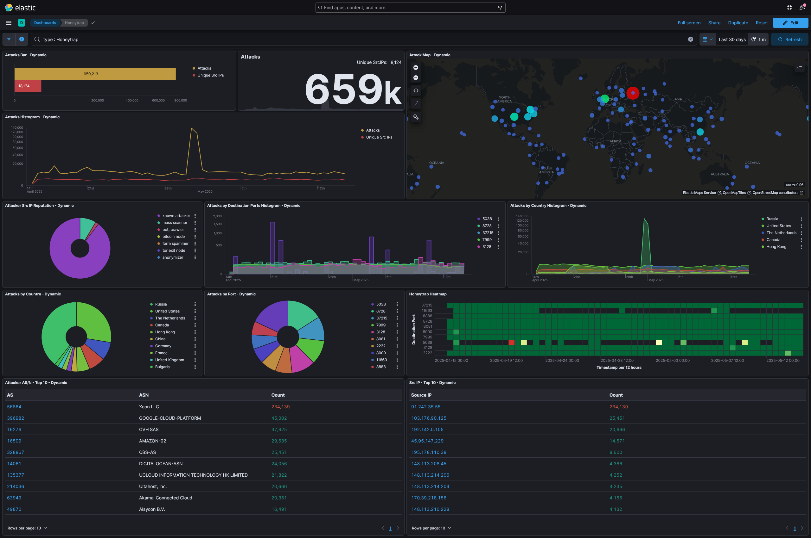

# 🛡️ T-Pot Honeypot Cloud Deployment Project

This project documents the deployment of a high-interaction honeypot on a cloud-hosted Ubuntu 24.04 LTS server. The honeypot system collects, analyzes, and visualizes real-world cyberattacks using Docker-based sensors and the ELK (Elastic) Stack.

Initially deployed on **Vultr Cloud**, this setup is cloud-agnostic and can be reproduced on **AWS**, **Azure**, or any public cloud provider supporting Ubuntu 24.04 LTS.

---

## 🎯 Objective

The goal of this project was to study global cyberattack patterns on exposed infrastructure. By simulating a publicly accessible cloud server, I was able to safely observe attacker behavior, analyze threat types, and evaluate the effectiveness of a hardened logging environment.

---

## 🛠️ Setup – Deployment Instructions

### 1️⃣ Provision the Ubuntu Server

1. Use a cloud provider (e.g., [Vultr](https://www.vultr.com/), AWS, Azure, DigitalOcean)
2. Deploy an instance with:
   - **Ubuntu 24.04 LTS x64**
   - **16 GB RAM**
   - **320 GB SSD**
3. Add your SSH key for secure login
4. Deploy and note the public IP

---

### 2️⃣ Initial Setup (as Root)

```bash
ssh root@<your_server_ip>
apt update && apt upgrade -y
apt install git -y
```

---

### 3️⃣ Create a Non-Root User

```bash
adduser tsec
usermod -aG sudo tsec
su - tsec
```

---

### 4️⃣ Install the Honeypot System

```bash
git clone https://github.com/telekom-security/tpotce
cd tpotce
./install.sh --type=user
```

- Select `Standard` during install
- Set secure credentials when prompted

---

### 5️⃣ Reboot and Configure

```bash
reboot
```

First boot may take 5–10 minutes to complete container setup.

---

### 6️⃣ Cloud Firewall Settings

| Action | Protocol | Ports       | Source     | Purpose                              |
|--------|----------|-------------|------------|--------------------------------------|
| Accept | TCP      | 1–65535     | 0.0.0.0/0  | Honeypot exposure (TCP)              |
| Accept | UDP      | 1–65535     | 0.0.0.0/0  | Honeypot exposure (UDP)              |
| Accept | TCP      | 64294–64297 | 0.0.0.0/0  | Admin/Kibana UI access               |
| Drop   | Any      | All         | 0.0.0.0/0  | Default deny rule                    |

---

## 📊 Dashboards

- Admin UI: `https://<your-ip>:64294`
- Kibana: `https://<your-ip>:64297/kibana`
- Real-time map: `https://<your-ip>:64297/map/`

> Accept browser warnings for self-signed certs.

---

## 🔐 Security Hardening

- Created a non-root deployment user
- SSH access restricted to key-only authentication
- Root login disabled
- Cloud firewall in place
- Admin UI ports can be IP-restricted

---

## 📈 Findings (After 1 Month)

After one month of continuous operation, the honeypot captured:

- **4+ million attack attempts**
- **Top targeted services**: Ciscoasa, Sentrypeer, Honeytrap, Cowrie, Dionaea
- **Frequent usernames**: `root`, `admin`, `administrator`, `AdMin1`
- **Passwords tried**: `123456`, `P@ssw0rd`, `123qwe`, `(empty)`, `admin123`, `000000`
- **Top attacker IPs and ASNs**: OVH, DigitalOcean, Xeon LLC, Internet Solutions
- **Malicious behavior**:
  - Exploits targeting SSH and SIP
  - Known C2 behavior and mass scanning bots
  - Payload attempts on FTP and HTTP honeypots

📸 Kibana Dashboards and Threat Maps:





---

## ✈️ Key Takeaways

-  Attacks began minutes after deployment  confirming cloud IPs are continuously scanned
-  Brute force and credential stuffing remain dominant across SSH and FTP
-  The diversity in payloads and sources demonstrates how broad attacker infrastructure really is
-  Honeypots are an effective, low-risk method to study and log live threats in action
-  This experiment models what could happen to improperly secured infrastructure in aviation, healthcare, or industrial control systems

---

## 🔍 Proactive Defense Use Case

Honeypots aren't just for academic researchthey can serve as early warning systems. By identifying attacker behavior and payloads before they reach production systems, defenders can:

-  Preemptively block IPs at the firewall level  
-  Generate custom IOC signatures for IDS/SIEM platforms  
-  Share insights with threat intel feeds  
-  Test detection rules for red team simulations

Integrating honeypot data into a blue team's workflow enables faster response and better situational awarenessespecially in environments with critical infrastructure.

## 📘 What’s Next

-  Automate alerting via webhook or Slack
-  Correlate attacker IPs with public threat feeds
-  Test integration with SIEM tools like Splunk or Sentinel
-  Track long-term behavioral changes week to week
-  Use honeypots in red/blue team training labs

---

## 🧠 About the Author

**Chalitha Handapangoda**  
Cloud & Security Enthusiast  
🔗 [LinkedIn](https://www.linkedin.com/in/chalitha-handapangoda/)  
📝 [Medium](https://chalithah.medium.com)

