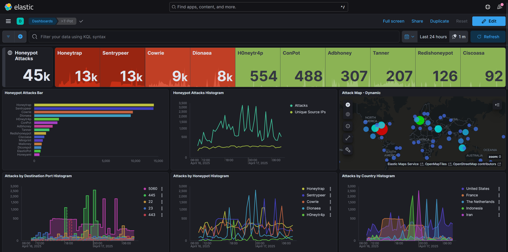
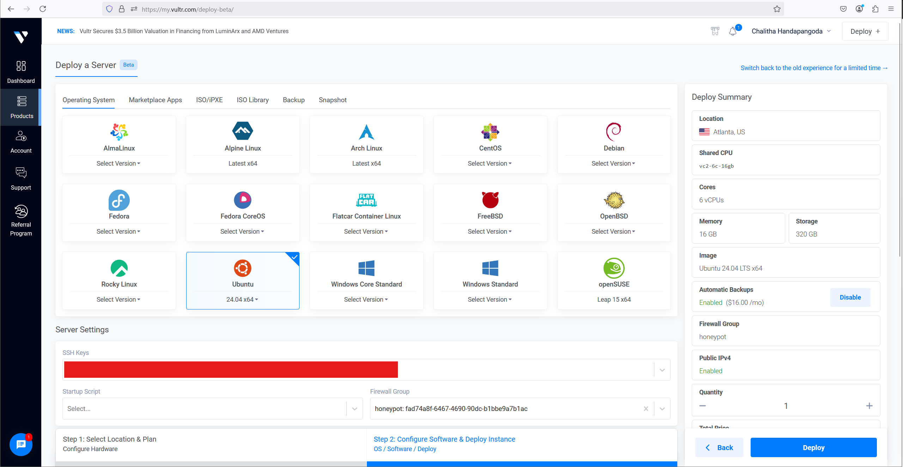
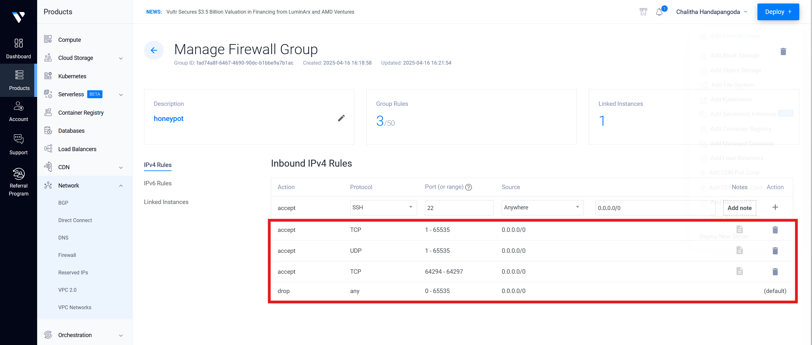

# 🛡️ T-Pot Honeypot Cloud Deployment Project

This project documents the deployment of the [T-Pot Honeypot](https://github.com/telekom-security/tpotce) platform on a cloud-hosted Ubuntu 24.04 LTS server. T-Pot is a multi-container honeypot system that collects, analyzes, and visualizes real-world cyberattacks using Docker-based sensors and the ELK (Elastic) Stack.

In this project, I deployed T-Pot on a **Vultr Cloud** instance, but the same setup can be reproduced on **AWS EC2**, **Azure VM**, or any other public cloud provider supporting Ubuntu 24.04 LTS.


---

## 🎯 Objective

The goal of this project is to observe common attack patterns on exposed cloud infrastructure. By running T-Pot in a controlled Vultr environment, I collected real-world threat data and analyzed it to gain insights on how attackers behave in the wild, especially relevant to airport and critical infrastructure security.

---

## 🛠️ Setup - Deployment Instructions

### 1️⃣ Provision the Ubuntu Server

1. Go to your preferred cloud provider (e.g., [Vultr](https://www.vultr.com/), AWS EC2, Azure, DigitalOcean)
2. Create a new virtual machine (VM) or instance
3. Choose **Ubuntu 24.04 LTS x64** as the OS
4. Allocate at least:
   - 16 GB RAM
   - 320 GB SSD
5. Add your **SSH public key** for secure access
6. Deploy the server and note the public IP address

---

### 2️⃣ Initial Setup (as Root)

```bash
ssh root@<your_server_ip>
apt update && apt upgrade -y
apt install git -y
```

---

### 3️⃣ Create a Non-Root User for T-Pot

```bash
adduser tsec
usermod -aG sudo tsec
su - tsec
```

---

### 4️⃣ Install T-Pot

```bash
git clone https://github.com/telekom-security/tpotce
cd tpotce
./install.sh --type=user
```

- Select **Standard** installation
- Set a secure password for access

---

### 5️⃣ Reboot the Server

```bash
reboot
```

> ⚠️ First boot may take 5–10 minutes to initialize all containers.

---

### 6️⃣ Configure Vultr Firewall

| Action | Protocol | Ports       | Source     | Description                                 |
|--------|----------|-------------|------------|---------------------------------------------|
| Accept | TCP      | 1–65535     | 0.0.0.0/0  | Allow all TCP traffic for honeypots         |
| Accept | UDP      | 1–65535     | 0.0.0.0/0  | Allow all UDP traffic for honeypots         |
| Accept | TCP      | 64294–64297 | 0.0.0.0/0  | Access to Web UI, Kibana, and Admin         |
| Drop   | Any      | All         | 0.0.0.0/0  | Block all other traffic                     |


---

### 7️⃣ Access the Dashboards

- T-Pot Admin UI → `https://<your-ip>:64294`
- Kibana Dashboard → `https://<your-ip>:64297/kibana`
- Attack Map → `https://<your-ip>:64297/map/`

> 🔐 Accept browser warning for self-signed certificate.

---

## 🔐 Security Hardening

- Created non-root user (`tsec`) for deployment
- Disabled root SSH login and password authentication
- SSH secured with key-based access only
- Vultr Cloud Firewall rules applied to restrict traffic
- UI ports are public but can be locked to IP in production

---

## 📈 Findings (First 24 Hours)

Using the Kibana dashboard and raw log discovery:

- Over **45,000 attacks** detected in 24 hours
- Top services targeted:
  - Cowrie (SSH) – brute force attempts
  - Dionaea – attempts to push malware payloads
- Common attacker usernames: `root`, `admin`, `ubuntu`, `oracle`
- Passwords attempted: `123456`, `admin123`, `password`, `1234`
- Majority of attacker IPs originated from:
  - 🇮🇷 Iran
  - 🇺🇸 United States
  - 🇫🇷 France
  - 🇳🇱 The Netherlands
- Suricata Alerts:
  - IPv4 truncated packets
  - ICMP communication issues
  - Suspicious stream reassembly sequences

📸 Suricata Alerts & KQL Discovery:


---

## ✈️ Takeaways

This deployment simulated what happens when infrastructure is exposed on the public internet. Key insights:

- 🕐 Attacks began within minutes of deployment — **internet-facing services are always watched**
- 🧠 Brute force attempts and opportunistic malware delivery dominate early-stage threats
- ✈️ Lessons here directly tie to airport/critical infrastructure security:
  - Isolated systems must never be internet-exposed without layered defenses
  - Log collection, analysis, and alerting are critical
  - Honeypots can safely simulate and test defenses

---

## 📘 What's Next

- Automate log archival and alerting (e.g., Slack notifications)
- Add threat enrichment using public IP blacklists
- Explore integration with a SIEM like Splunk or Microsoft Sentinel
- Visualize trends weekly to observe attacker shifts

---

## 🧠 Author

**Chalitha Handapangoda**  
Cloud & Security Enthusiast  
🔗 [LinkedIn](https://www.linkedin.com/in/chalitha-handapangoda/)  
📝 [Medium](https://chalithah.medium.com)


---

## 🪪 License

MIT License — free to use for learning and demonstration purposes.
